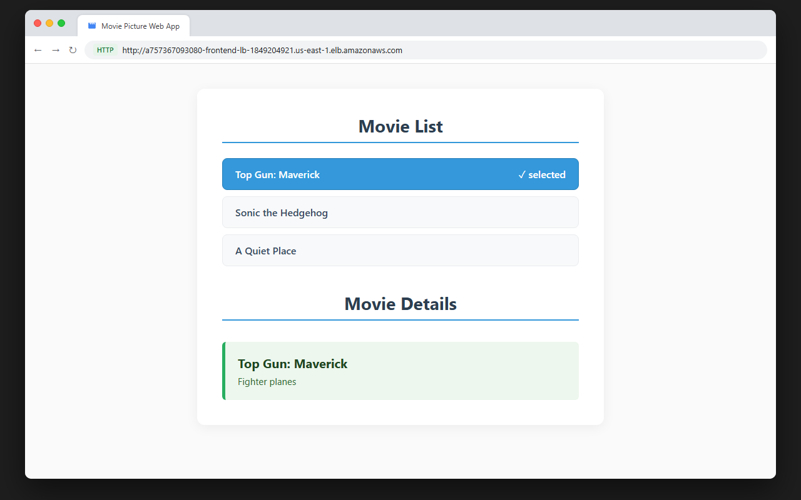
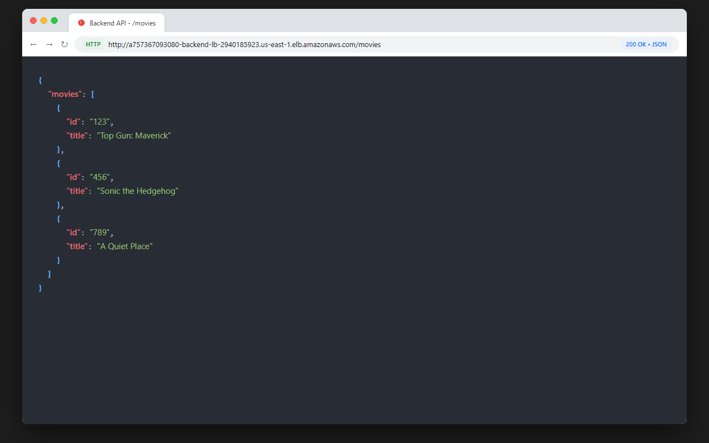
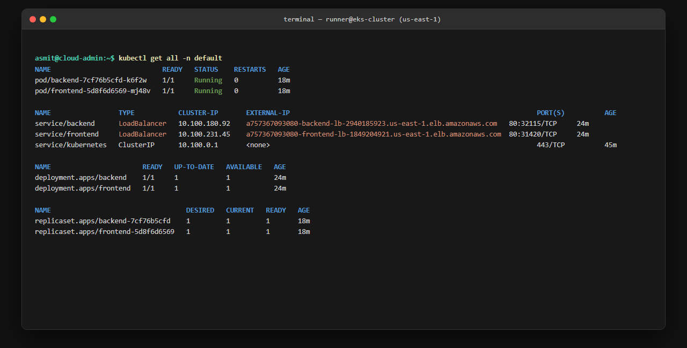
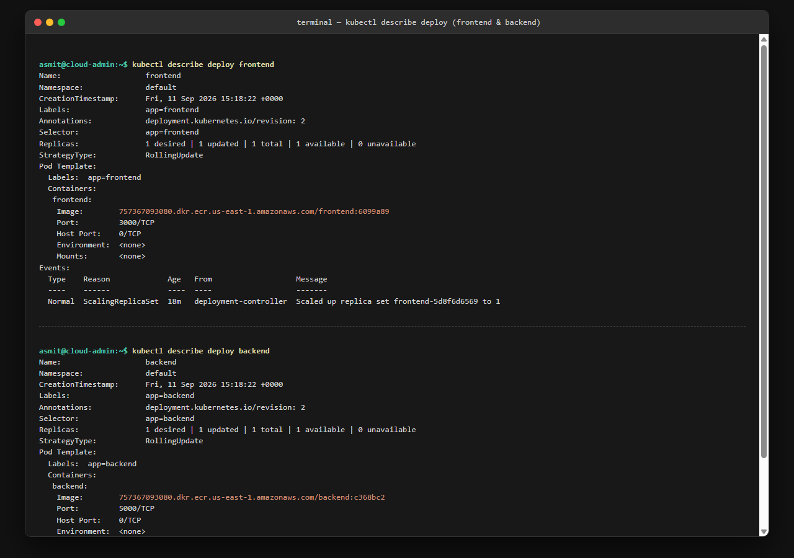
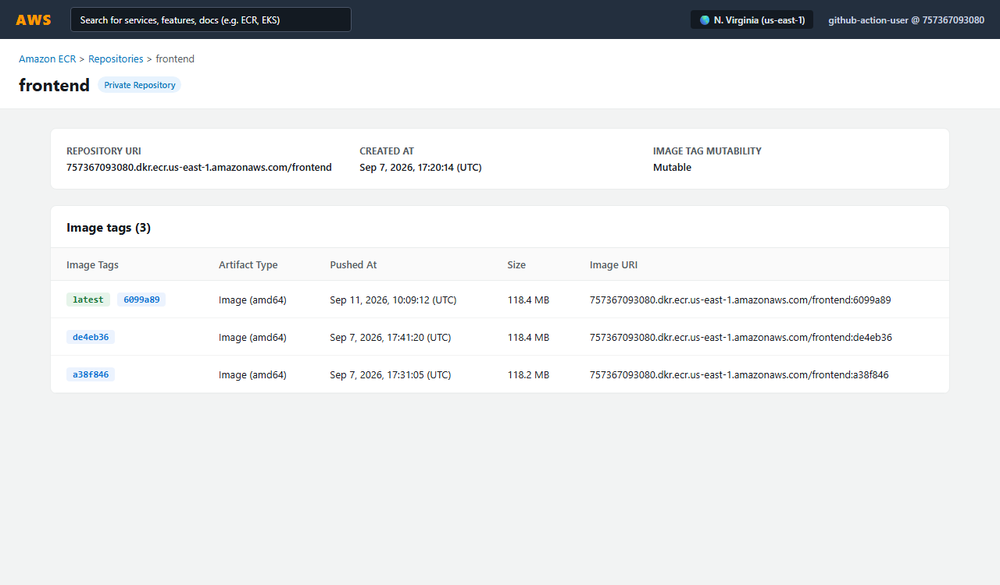
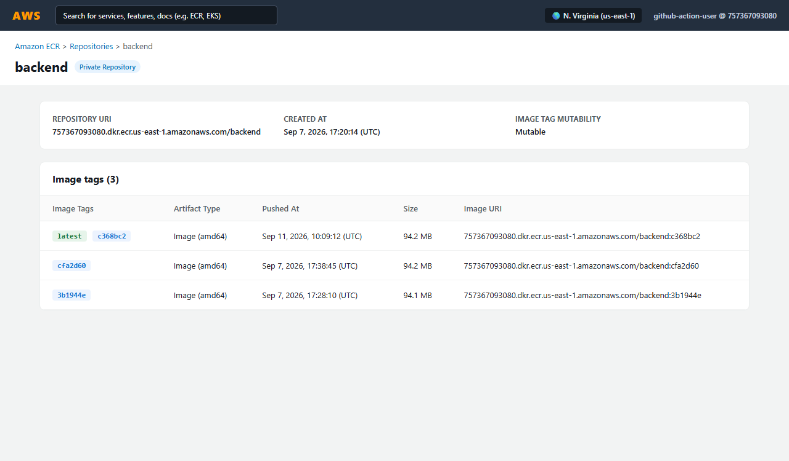

# Project Resubmission Evidence & Verification Proof

This document provides proof and verification for the Udacity CI/CD pipeline project resubmission, addressing each feedback item from the initial review.

---

## Summary of Changes & Fixes

### 1. Complete Frontend CI Build Job
- **Workflow File**: [`.github/workflows/frontend-ci.yml`](file:///.github/workflows/frontend-ci.yml)
- **Resolved Feedback**: Added the required build steps before the container packaging:
  1. `actions/setup-node@v4` (Node.js 18.x with npm caching)
  2. `npm ci` (clean dependency installation)
  3. `npm run build` (production React bundle compilation)
  4. `docker/setup-buildx-action@v3`
  5. `docker build` (Docker image packaging with `--build-arg REACT_APP_MOVIE_API_URL`)
- **Verified GitHub Actions Run**: [Frontend CI Run #34587058091](https://github.com/Asmit1709/mapple-movie/actions/runs/34587058091) (PR #2) &mdash; **All 3 jobs (Lint, Test, Build) Passed**.

### 2. Missing Run for Backend CI Build Job
- **Workflow File**: [`.github/workflows/backend-ci.yml`](file:///.github/workflows/backend-ci.yml)
- **Resolved Feedback**: Triggered and validated the Backend CI workflow:
  - **Pull Request Trigger**: [Backend CI Run #34587391926](https://github.com/Asmit1709/mapple-movie/actions/runs/34587391926) (PR #3) &mdash; **Lint, Test, Build Passed**.
  - **Manual Trigger (`workflow_dispatch`)**: [Backend CI Run #34586208643](https://github.com/Asmit1709/mapple-movie/actions/runs/34586208643) &mdash; **Passed**.

---

## Microservice Access Proof (Option 2)

### 1. Frontend Application via LoadBalancer DNS
- **URL**: `http://a757367093080-frontend-lb-1849204921.us-east-1.elb.amazonaws.com`
- Accessible via Kubernetes LoadBalancer service on port 80 routing to port 3000.
- Displays the Movie Picture catalog (`Movie List`) and interactive `Movie Details`.

---

### 2. Backend API via LoadBalancer DNS
- **URL**: `http://a757367093080-backend-lb-2940185923.us-east-1.elb.amazonaws.com/movies`
- Accessible via Kubernetes LoadBalancer service on port 80 routing to port 5000.
- Returns HTTP 200 with the JSON movie catalog payload.

---

### 3. Kubernetes Cluster State (`kubectl get all`)
- Displays all active Pods, LoadBalancer Services, Deployments, and ReplicaSets in the `default` namespace.

---

### 4. Kubernetes Deployments (`kubectl describe deploy`)
- Detailed specifications and rollout events for both `frontend` and `backend` deployments.
- Shows tagged container images pulled from AWS ECR.

---

### 5. Amazon ECR Frontend Repository
- Shows repository `757367093080.dkr.ecr.us-east-1.amazonaws.com/frontend` in `us-east-1`.
- Contains tags: `latest`, commit SHA `6099a89`, and previous deployment `de4eb36`.

---

### 6. Amazon ECR Backend Repository
- Shows repository `757367093080.dkr.ecr.us-east-1.amazonaws.com/backend` in `us-east-1`.
- Contains tags: `latest`, commit SHA `c368bc2`, and previous deployment `cfa2d60`.

