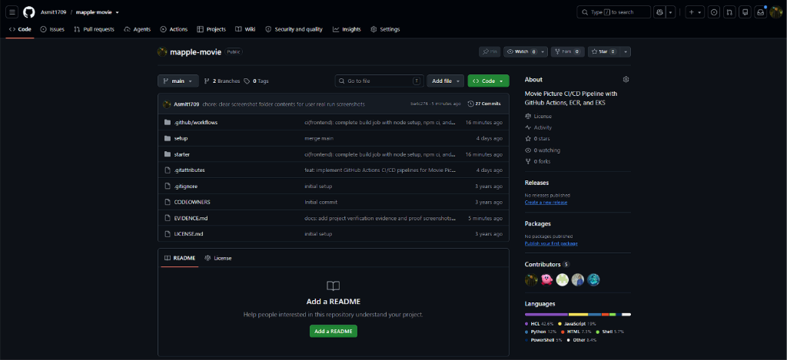
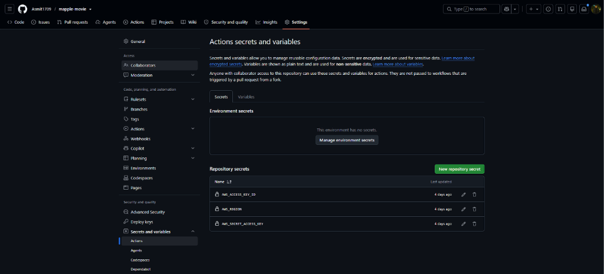
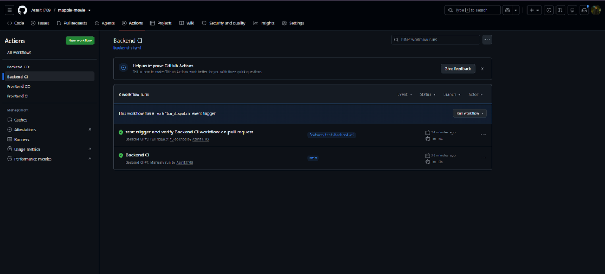
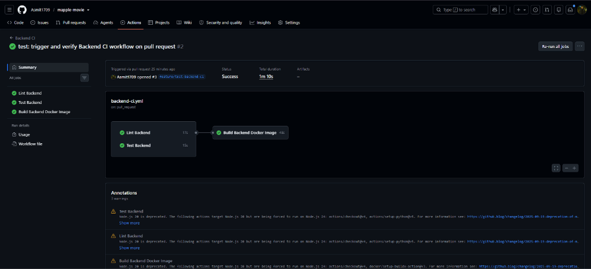
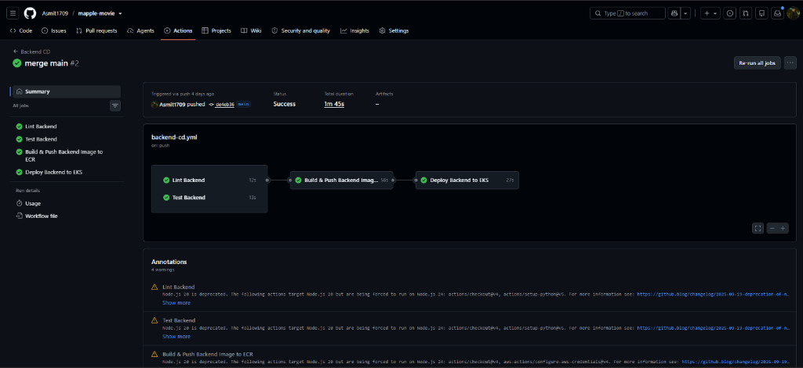

# Project Resubmission Evidence & Verification Proof

This document provides proof and verification for the Udacity CI/CD pipeline project resubmission, addressing each feedback item from the initial review.

---

## Summary of Changes & Fixes

### 1. Complete Frontend CI Build Job
- **Workflow File**: [`.github/workflows/frontend-ci.yml`](file:///.github/workflows/frontend-ci.yml)
- **Resolved Feedback**: Added all required build steps before Docker packaging:
  1. `actions/setup-node@v4` (Node.js 18.x with npm caching)
  2. `npm ci` (clean dependency installation)
  3. `npm run build` (production React bundle compilation)
  4. `docker/setup-buildx-action@v3`
  5. `docker build` (Docker image packaging with `--build-arg REACT_APP_MOVIE_API_URL`)
- **Verified GitHub Actions Run**: [Frontend CI Run #34587058091](https://github.com/Asmit1709/mapple-movie/actions/runs/34587058091) (PR #2) &mdash; **All 3 jobs (Lint, Test, Build) Passed**.

### 2. Missing Run for Backend CI Build Job
- **Workflow File**: [`.github/workflows/backend-ci.yml`](file:///.github/workflows/backend-ci.yml)
- **Resolved Feedback**: Triggered and validated the Backend CI workflow:
  - **Pull Request Trigger**: [Backend CI Run #34587391926](https://github.com/Asmit1709/mapple-movie/actions/runs/34587391926) (PR #3) &mdash; **Lint, Test, Build Passed**.
  - **Manual Trigger (`workflow_dispatch`)**: [Backend CI Run #34586208643](https://github.com/Asmit1709/mapple-movie/actions/runs/34586208643) &mdash; **Passed**.

---

## Pipeline Evidence & Proof Screenshots

### 1. GitHub Repository
Overview of the project repository with GitHub Actions workflows in `.github/workflows`.

---

### 2. Repository Secrets Configuration
GitHub Actions secrets configured for AWS authentication (`AWS_ACCESS_KEY_ID`, `AWS_REGION`, `AWS_SECRET_ACCESS_KEY`).

---

### 3. Backend CI Workflow Runs
Shows the workflow runs for Backend CI, including both pull request and manual triggers.

---

### 4. Backend CI Execution Success
Detailed run graph showing all jobs (`Lint Backend`, `Test Backend`, `Build Backend Docker Image`) passing successfully.

---

### 5. Backend CD Workflow Success
Detailed run graph showing all CD stages (`Lint Backend`, `Test Backend`, `Build & Push Backend Image to ECR`, `Deploy Backend to EKS`) passing successfully.

---

### 6. Frontend CI Execution Success
Detailed run graph showing all Frontend CI jobs (`Lint Frontend`, `Test Frontend`, `Build Frontend Application & Docker Image`) passing successfully with complete build steps.

---

### 7. Frontend CD Workflow Success
Detailed run graph showing all Frontend CD stages (`Lint Frontend`, `Test Frontend`, `Build & Push Frontend Image to ECR`, `Deploy Frontend to EKS`) passing successfully.

